# FitPerfect

**A private-by-default iOS fitness-coaching MVP that turns a short phone video into exercise feedback, rep counts, joint-angle analysis, and 3D motion data.**

FitPerfect helps people train with more confidence when a coach is not present.
The app guides a user through camera setup and recording, then performs full post-recording analysis locally in roughly 30 seconds for a typical session.
It currently supports squat and overhead dumbbell press analysis on iOS.

## Why this project stands out

Most fitness trackers record what happened.
FitPerfect is built to explain how the movement was performed.

- **Private by default:** raw video is processed on the device rather than requiring it to be sent to a server for core analysis.
- **A real mobile ML pipeline:** the app combines person detection, 2D pose estimation, temporal 3D pose lifting, and exercise-specific feedback in a Flutter application.
- **End-to-end product work:** camera calibration, live visual guidance, video processing, data persistence, feedback UX, authentication, localization, and optional cloud storage are integrated in one MVP.
- **Built for constrained devices:** the pipeline selects platform-appropriate ONNX Runtime providers and performs the computationally intensive analysis after recording instead of compromising the capture experience.

## Product flow

1. Select an exercise and align with the camera guidance.
2. Use the live skeleton overlay and device-tilt calibration to prepare for recording.
3. Record a set on an iPhone.
4. FitPerfect samples the video and runs local pose analysis.
5. Review form score, rep count, joint angles, detected mistakes, and generated 3D pose data.

## What it does today

- Supports an iOS MVP for squats and overhead dumbbell presses.
- Captures exercise video with setup and calibration guidance.
- Detects the primary person with YOLOv8.
- Estimates 17 COCO body keypoints with RTMPose.
- Converts 2D keypoints into H36M joint layout and estimates 3D motion with MotionBERT.
- Produces form scores, rep counts, joint-angle analysis, and mistake detection.
- Stores portable per-session artifacts locally, including video, JSONL keypoints, 3D output, and metadata.
- Renders live and reference skeleton overlays that respect camera preview fitting and mirroring.
- Provides sign-in, optional S3 upload, session sharing, English and Polish UI localization, and product screens for exercise selection, feedback, progress, and profile.

## Architecture

```mermaid
flowchart LR
    A[Flutter iOS UI] --> B[Camera setup and live calibration]
    B --> C[Record exercise video]
    C --> D[FFmpeg frame sampling]
    D --> E[YOLOv8 person detection]
    E --> F[RTMPose 2D keypoints]
    F --> G[COCO-17 to H36M-17 mapping]
    G --> H[MotionBERT 3D lifting]
    H --> I[Form analysis and feedback]
    I --> J[Local session artifacts]
    J -. optional .-> K[AWS Cognito and S3]
```

The core feedback path is local.
Cloud services support authentication and optional file upload rather than being required for private-by-default analysis.

## Technical highlights

### Coordinate-system correctness

Camera and pose pipelines fail silently when coordinate transforms drift.
FitPerfect explicitly tracks the transforms between raw camera frames, square YOLO letterboxes, person crops, RTMPose inputs, and the fitted camera preview.
The live overlay applies the same `BoxFit`, alignment, and front-camera mirroring behavior as the preview so the skeleton remains visually aligned.

### Robust model integration on mobile

The ONNX integration handles more than one model-output convention.
RTMPose decoding detects and supports both SimCC and heatmap outputs, while YOLO decoding handles common tensor layouts and normalized or pixel-space boxes.
Inference sessions prefer Core ML on Apple platforms, NNAPI on Android, and XNNPACK or CPU where appropriate.

### Temporal 3D pose estimation

MotionBERT expects a strict `[batch, time, 17, 3]` input layout.
The pipeline converts COCO-17 joints to H36M-17, centers and normalizes input, manages fixed temporal windows, merges overlapping predictions, and emits 3D session data with validation-oriented metadata.

### Durable, inspectable sessions

Each analysis session has a stable local layout rather than ephemeral in-memory output.
Artifacts include detection JSONL, 2D keypoints, 3D pose output, metadata, logs, and optional debug data.
Temporary files are renamed only after successful writes to avoid presenting incomplete results as finished sessions.

### Engineering for real capture conditions

The app uses a reference-pose matcher, camera tilt checks, live skeleton feedback, ROI expansion, and person-selection heuristics to make the capture flow practical outside a controlled laboratory setting.

## Technology stack

| Area | Technologies |
| --- | --- |
| Mobile app | Flutter, Dart, Material 3, GoRouter |
| State and UI | Riverpod, Provider, Google Fonts, Flutter localization |
| On-device ML | ONNX Runtime Mobile, YOLOv8, RTMPose, MotionBERT |
| Video and imaging | Camera, FFmpeg Kit, `image`, native iOS and Android bridges |
| Cloud integration | AWS Amplify, Cognito, S3 |
| Device integration | Sensors, secure storage, sharing, image picker |

## Repository guide

| Path | Purpose |
| --- | --- |
| `lib/screens/` | Product screens, including exercise capture and feedback flows. |
| `lib/shared/services/` | ONNX inference, preprocessing, video sampling, pose processing, storage, uploads, and API clients. |
| `lib/shared/widgets/` | Live skeleton rendering and processing-state UI. |
| `assets/models/` | Bundled ONNX models and development validation artifacts. |
| `assets/meta/` | Pose metadata and skeleton reference data. |
| `amplify/` | Amplify configuration for Cognito and S3. |
| `pipeline_mvp_en.md` | Detailed specification of the pose-processing pipeline and session artifacts. |

## Run locally

The validated target for this MVP is iOS.

1. Install a compatible Flutter SDK and Xcode.
2. Fetch dependencies with `flutter pub get`.
3. Configure a physical iPhone for camera capture.
4. Review the Amplify configuration before using sign-in or optional cloud upload.
5. Run the app with `flutter run`.

The model assets make the repository large by design.
They are included to support local inference rather than delegating core analysis to a hosted service.

## Current scope and next steps

FitPerfect is a complete iOS MVP for the supported exercises, with intentional room to evolve.

Next steps include expanding the exercise library, hardening the processing pipeline across more devices and capture conditions, replacing prototype progress data with persisted session history, adding a richer in-app 3D viewer, and extending platform validation beyond iOS.

## Portfolio authorship

FitPerfect was built end to end by the repository owner.
AI-assisted development was used for portions of the frontend implementation, while the product integration, mobile ML pipeline, and end-to-end MVP delivery are represented in this repository.

## Demo media

The app has working general-product and exercise-feedback demos.
The exact portfolio-ready capture list is in [docs/README_ASSETS_TODO.md](docs/README_ASSETS_TODO.md).
